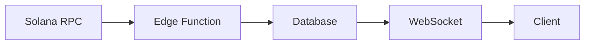
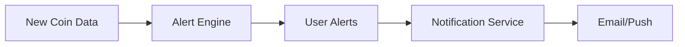

# System Architecture

## Overview
This document outlines the technical architecture of the Solana Raydium Coin Alert Service.

## System Components

### 1. Frontend Layer
```
Frontend (Next.js App Router)
├── Pages
│   ├── Landing Page (Static)
│   ├── Dashboard (Dynamic SSR)
│   └── Alert Management (Dynamic CSR)
├── Components
│   ├── Shared UI Components
│   ├── Dashboard Widgets
│   └── Alert Configuration Forms
└── State Management
    ├── React Context
    └── SWR for Data Fetching
```

### 2. Backend Layer
```
Backend (Next.js API Routes)
├── API Routes
│   ├── Authentication
│   ├── Coin Monitoring
│   ├── Alert Management
│   └── User Management
├── Edge Functions
│   ├── Real-time Price Updates
│   └── Quick Data Validation
└── WebSocket Server
    └── Real-time Updates
```

### 3. Data Layer
```
Database (Vercel Postgres)
├── Users
├── Alerts
├── CoinMetrics
└── AlertHistory
```

## Data Flow

1. **Coin Monitoring Flow**


2. **Alert Processing Flow**


## Key Technologies

### Frontend
- Next.js 13+ (App Router)
- React with TypeScript
- Tailwind CSS
- SWR for data fetching
- Chart.js for visualizations

### Backend
- Next.js API Routes
- Edge Functions
- WebSocket (Socket.io)
- Bull.js for job queues

### Database
- Vercel Postgres
- Redis for caching
- Prisma as ORM

### Blockchain Integration
- Solana Web3.js
- Raydium SDK
- Solscan API

## Performance Considerations

### Caching Strategy
1. **Static Content**
   - ISR for semi-static pages
   - CDN caching for assets

2. **Dynamic Content**
   - Redis for hot data
   - SWR for client-side caching

### Edge Functions Usage
- Price updates
- Basic data validation
- Geolocation-based routing

## Security Architecture

### Authentication Flow
1. NextAuth.js integration
2. JWT token management
3. Role-based access control

### Data Protection
1. Input validation
2. Rate limiting
3. CSRF protection
4. Data encryption

## Monitoring & Observability

### Metrics Collection
- Request latency
- Error rates
- Database performance
- Blockchain API response times

### Alerting
- System health
- API availability
- Database connection
- Blockchain node status

## Deployment Architecture

### Vercel Setup
1. **Production Environment**
   - Main deployment
   - Database
   - Edge functions
   - Analytics

2. **Preview Environments**
   - PR previews
   - Staging environment
   - Development branches

### CI/CD Pipeline
1. Code validation
2. Test execution
3. Preview deployment
4. Production deployment 